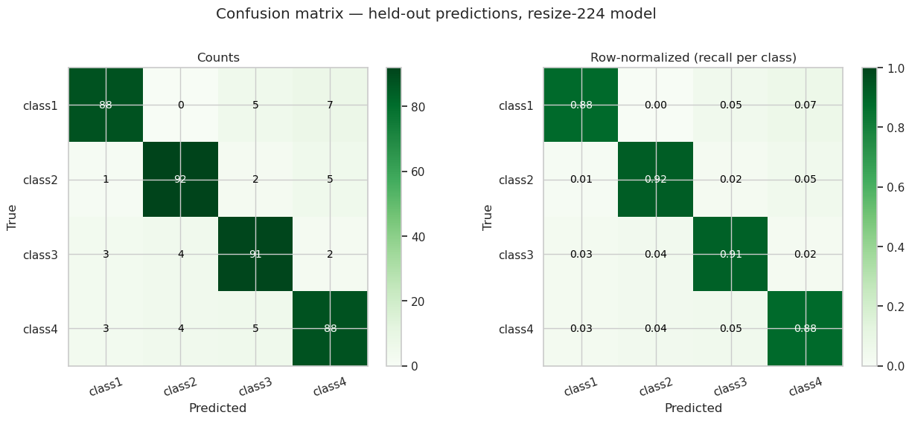
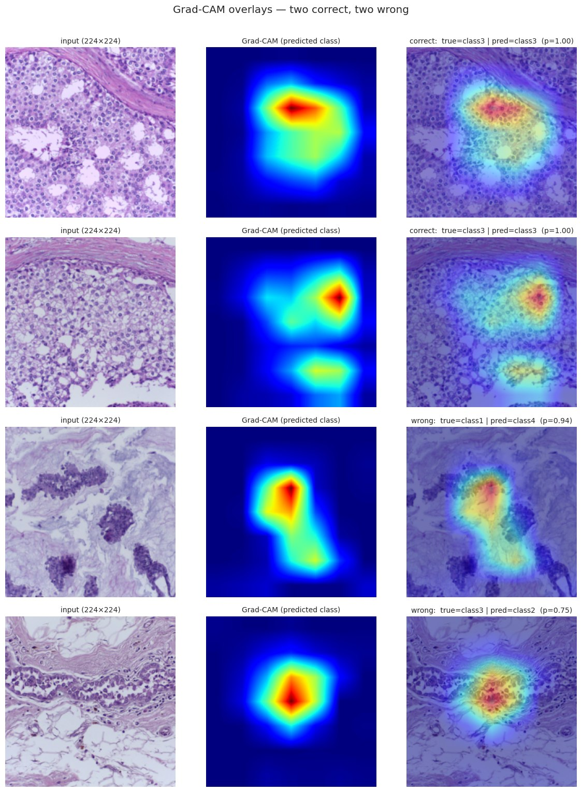

# Histopathology Tissue Classification

Deep learning pipeline for classifying H&E-stained tissue patches into 4 classes, built
around stratified 5-fold cross-validation on a small dataset (n=400) and an ablation
study comparing preprocessing/augmentation choices.

> **About the classes.** The 4 classes are provided pre-anonymized as `class1`–`class4`,
> with no semantic labels. Based on the image count, format, and dimensions (400 images,
> 100/class, H&E-stained, 2048×1536 TIFF), this closely matches the public
> [ICIAR2018 BACH](https://iciar2018-challenge.grand-challenge.org/Dataset/) breast cancer
> histology dataset, where the 4 classes represent a malignancy spectrum: **normal, benign,
> in situ carcinoma, and invasive carcinoma**. The pipeline below treats it as a blind 4-class problem.

**TL;DR**

- **Task.** 4-class H&E tissue classification, *n* = 400 (100 per class), image-level labels at 2048×1536.
- **Best model.** ResNet-50 (ImageNet-pretrained) + classic resize-224 pipeline.
- **Result.** Macro-F1 **0.898 ± 0.033** on stratified 5-fold CV with held-out predictions for every image.
- **Most informative finding.** The ablation (`04.`) overturned the preprocessing (`02.`) "crop-over-resize" prior — the smaller, ImageNet-native resolution beat the higher-res crop.
- **Where to look:**
  - `01. eda_walkthrough.ipynb` — bit-depth audit, data sanity check, leakage analysis (visual + TIFF metadata)
  - `02. preprocessing_walkthrough.ipynb` — normalization, crop-vs-resize, augmentation choices
  - `03. model_training_walkthrough.ipynb` — main 5-fold CV with the full training protocol
  - `04. ablation_walkthrough.ipynb` — resize-224 vs. crop-512 vs. crop-512 + HED jitter
  - `05. evaluation_walkthrough.ipynb` — confusion matrix, per-class P/R/F1, failure gallery, Grad-CAM, summary

## Results





## Setup

```bash
conda env create -f environment.yml
conda activate tissue-classification
```

The raw TIFF dataset is not included in this repo — place it under `data/<class_name>/*.tif`
to run the notebooks yourself.

## Project structure

```text
histopathology-tissue-classification/
├── 01. eda_walkthrough.ipynb             # data & leakage audit
├── 02. preprocessing_walkthrough.ipynb   # preprocessing & augmentation
├── 03. model_training_walkthrough.ipynb  # model & 5-fold CV training
├── 04. ablation_walkthrough.ipynb        # resize-vs-crop-vs-HED ablation
├── 05. evaluation_walkthrough.ipynb      # evaluation, diagnostics, summary
├── tissue.py                             # shared library: data loading, model, training, eval
├── scripts/                              # headless CV/ablation runners, built on tissue.py
├── environment.yml
└── LICENSE
```

## License

MIT — see [LICENSE](LICENSE).
